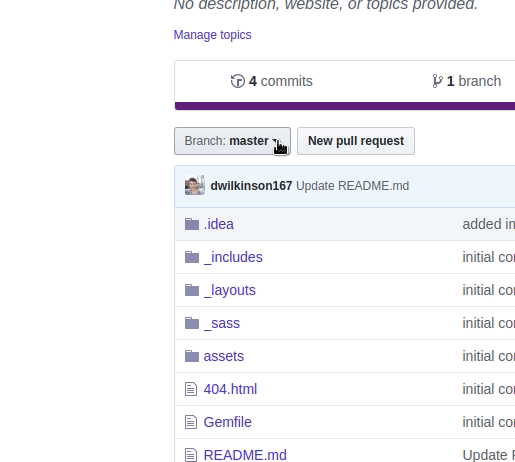
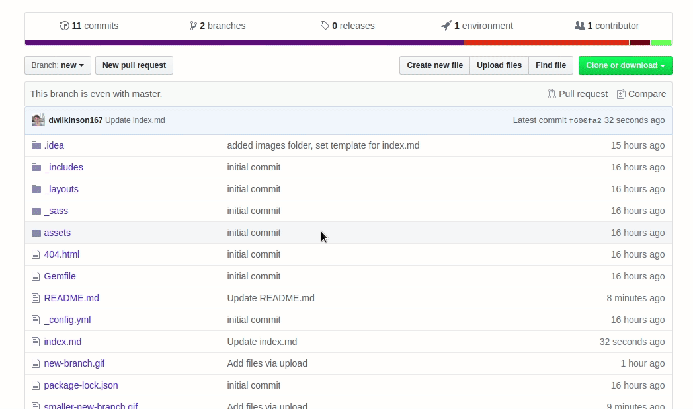
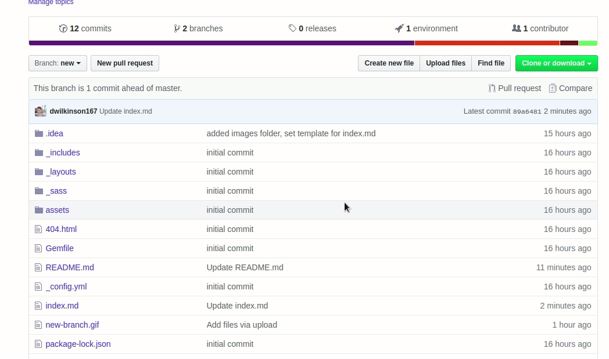

# github-pages-itc134-fl2019

* **Clone if you want to work locally. [Here](https://jbt.github.io/markdown-editor/) is a Markdown editor for seeing how things will look without having to clone the repo.**
* **Create a branch and call it new. You can do this on the github webpage.** 

* **Edit index.md**

* **Open Pull request**

